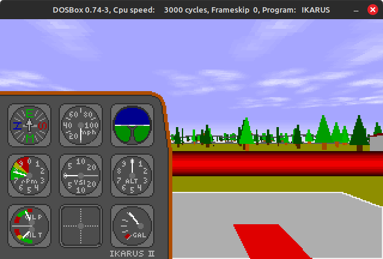
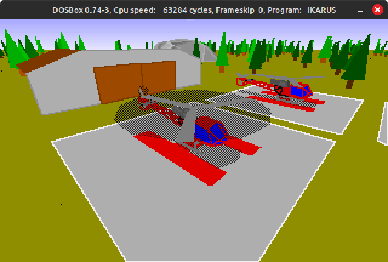

1994: This is one of my first attempts to write a flight simulator. The host was a Compaq SLT 286, developed with Borland Turbo C and Turbo Assembler. The exe in the EXE directory also runs under DosBox.

